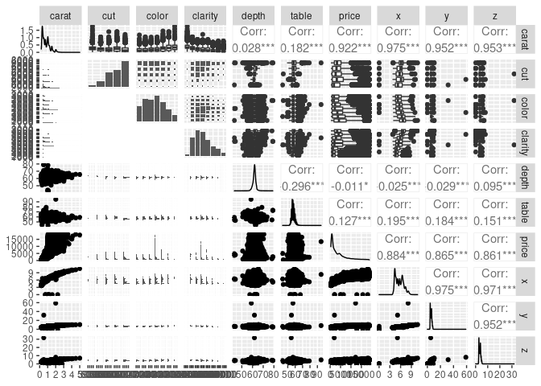
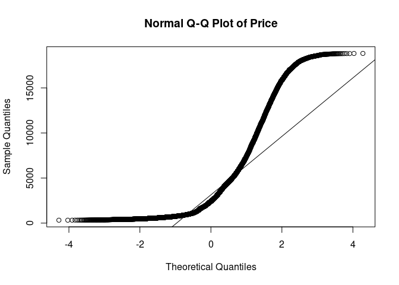
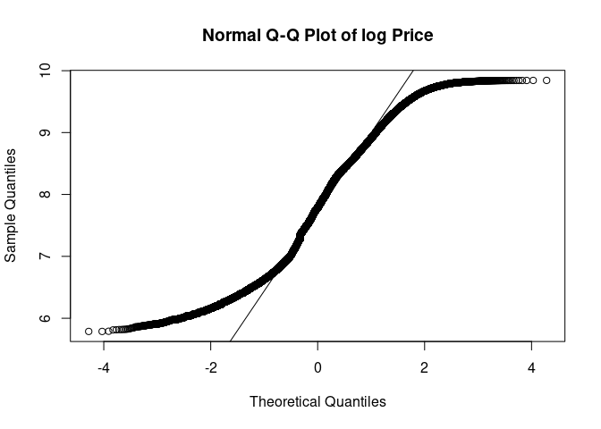

Best Day of My Life
================
Heather Zurel
2022-08-18

### WIP

The best day of my life was when my partner asked me to marry him. He
was curious whether he overpaid for the diamond he bought me (he thinks
he got a great deal!) - so let’s see.

I’m going to use the diamonds data set to train a regression model to
predict the price of diamonds based on their physical properties,
including size/carat, clarity, colour, etc.

The first step is some **exploratory data analysis** to see if we need
to do anything to clean the data before training the model.

P.S. There are some additional analyses, plots, etc. that are included
in the `diamonds.r` file in github, which have not made it to this
document.

# Preparation and Exploratory Data Analysis

``` r
# Setup
library('tidyverse')
library('GGally')

# Import
data(diamonds)

# Exploratory 
summary(diamonds)
```

    ##      carat               cut        color        clarity          depth      
    ##  Min.   :0.2000   Fair     : 1610   D: 6775   SI1    :13065   Min.   :43.00  
    ##  1st Qu.:0.4000   Good     : 4906   E: 9797   VS2    :12258   1st Qu.:61.00  
    ##  Median :0.7000   Very Good:12082   F: 9542   SI2    : 9194   Median :61.80  
    ##  Mean   :0.7979   Premium  :13791   G:11292   VS1    : 8171   Mean   :61.75  
    ##  3rd Qu.:1.0400   Ideal    :21551   H: 8304   VVS2   : 5066   3rd Qu.:62.50  
    ##  Max.   :5.0100                     I: 5422   VVS1   : 3655   Max.   :79.00  
    ##                                     J: 2808   (Other): 2531                  
    ##      table           price             x                y         
    ##  Min.   :43.00   Min.   :  326   Min.   : 0.000   Min.   : 0.000  
    ##  1st Qu.:56.00   1st Qu.:  950   1st Qu.: 4.710   1st Qu.: 4.720  
    ##  Median :57.00   Median : 2401   Median : 5.700   Median : 5.710  
    ##  Mean   :57.46   Mean   : 3933   Mean   : 5.731   Mean   : 5.735  
    ##  3rd Qu.:59.00   3rd Qu.: 5324   3rd Qu.: 6.540   3rd Qu.: 6.540  
    ##  Max.   :95.00   Max.   :18823   Max.   :10.740   Max.   :58.900  
    ##                                                                   
    ##        z         
    ##  Min.   : 0.000  
    ##  1st Qu.: 2.910  
    ##  Median : 3.530  
    ##  Mean   : 3.539  
    ##  3rd Qu.: 4.040  
    ##  Max.   :31.800  
    ## 

``` r
ggpairs(diamonds)
```

<!-- -->

So the x, y, and z values correspond to the physical dimensions of the
diamonds in millimeters - these correlate strongly with the carat value,
which is a measure of the weight of the diamonds - this makes sense & we
really don’t need to include all of them. Some ML models are sensitive
to including multiple features which are strongly correlated with each
other - this can lead to overfitting - so we will remove the x, y, and z
variables before we train the model.

### Distribution of the Target Variable (Price in USD)

Q-Q plots (or quantile-quantile plots) are used to quickly, visually
identify the distribution of a single variable.

``` r
qq_diamonds <- qqnorm((diamonds$price),main="Normal Q-Q Plot of Price");qqline((diamonds$price))
```

<!-- -->

``` r
# Meh

qq_log_diamonds <- qqnorm(log(diamonds$price),main="Normal Q-Q Plot of log Price");qqline(log(diamonds$price))
```

<!-- -->

``` r
# Ooh this is a much better fit
```

``` r
hist_norm <- ggplot(diamonds, aes(log(price))) 
hist_norm + geom_histogram(aes(y = ..density..), colour = "black", fill = 'lightblue') + 
  stat_function(fun = dnorm, args = list(mean = mean(log(diamonds$price)), sd = sd(log(diamonds$price))))
```

<!-- -->

Based on the Q-Q plots and the histogram, it appears that the log of the
price follows a bimodal or multimodal distribution. Let try another
couple plots to see.

``` r
violin <- ggplot(diamonds, aes(x = color, y = log(price), fill = color))
violin + geom_violin() + scale_y_log10() + facet_grid(clarity ~ cut)
```

<!-- -->

``` r
carat <- ggplot(data = diamonds, aes(x = carat, y = log(price), colour = color)) 
carat + stat_ecdf() + facet_grid(clarity ~ cut)
```

<!-- -->

Yep, this definitely looks like a multimodal distribution with multiple
peaks in the distribution corresponding to increasing the carat of the
diamond from 0.99 to 1 carat, 1.99 to 2 carats, etc. And smaller jumps
around 1/2 carats.

### Variance of Numeric Variables

One more thing I’m going to check is the variance of the numeric
variables. If the variance of any variable is \>= 1 order of magnitude
different from the others, we will standardize these values. If the
variance of one variable is much larger than others, it can
over-emphasize the importance of these variables in training models.

``` r
diamonds %>% summarise_if(is.numeric, list(mean = mean, var = var)) %>% t()
```

    ##                    [,1]
    ## carat_mean 7.979397e-01
    ## depth_mean 6.174940e+01
    ## table_mean 5.745718e+01
    ## price_mean 3.932800e+03
    ## x_mean     5.731157e+00
    ## y_mean     5.734526e+00
    ## z_mean     3.538734e+00
    ## carat_var  2.246867e-01
    ## depth_var  2.052404e+00
    ## table_var  4.992948e+00
    ## price_var  1.591563e+07
    ## x_var      1.258347e+00
    ## y_var      1.304472e+00
    ## z_var      4.980109e-01

The `carat` variable is \> 1 order of magnitude less than that of the
`table` variable (and so close to 1 OOM smaller than `depth`), so we
will go ahead and standardize all 3.

I think I have enough info for the next step…

# Data Cleaning

We are going to remove some variables that are strongly correlated with
each other, leaving a single variable which captures that data contained
in the other 3 variables.

We are going to convert the price to the log of the price. Since this
data set is from 2017 and I am trying to predict the value of a diamond
bought in 2021, we will also adjust for inflation (approx 10.55%).

Another important consideration before training the models is to deal
with the categorical data. Often, these will be converted to “dummy
variables” or one-hot-encoded. This works when there is no natural
ranking or order of the categories. Here, the cut, clarity, and color
all have a natural order. For example, a diamond with a “good” cut is
better than a diamond with a “fair” cut. If you imported this data from
r (\`data(diamonds)) then these variables will already be factors with
the correct order. However, if you downloaded a csv of this data set,
these will need to be converted from strings to ordered factors, so I
will include the transformation step here (even though it shouldn’t
change anything in my data set - though it appears that the ‘color’
variable is in the reverse order so I’ll fix that too). Note: the levels
in this function are assigned from worst to best.

After investigating the table and depth fields some more, these values
are the ratio to the average diameter of the diamond. The table %
influences the light performance of the diamond (i.e. how sparkly it
looks). The depth % affect the diamond’s brilliance and fire (I’m not
100% sure what this means, but we’ll see if it affects price).

``` r
diamonds <- diamonds %>%
  mutate(price = price * 1.1055) %>%
  mutate(log_price = log(price)) %>%
  select(-price, -x, -y, -z) %>%
  mutate(cut = factor(cut, levels = c('Fair', 'Good', 'Very Good', 'Premium', 'Ideal'), ordered = TRUE),
         color = factor(color, levels = c('J', 'I', 'H', 'G', 'F', 'E', 'D'), ordered = TRUE),
         clarity = factor(clarity, levels = c('I1', 'SI2', 'SI1', 'VS2', 'VS1', 'VVS2', 'VVS1', 'IF'), ordered = TRUE)) %>%
  mutate_at(c('carat', 'table', 'depth'), ~(scale(.) %>% as.vector))

# This should show that these three variables are now ordered factors.
str(diamonds)
```

    ## tibble [53,940 × 7] (S3: tbl_df/tbl/data.frame)
    ##  $ carat    : num [1:53940] -1.2 -1.24 -1.2 -1.07 -1.03 ...
    ##  $ cut      : Ord.factor w/ 5 levels "Fair"<"Good"<..: 5 4 2 4 2 3 3 3 1 3 ...
    ##  $ color    : Ord.factor w/ 7 levels "J"<"I"<"H"<"G"<..: 6 6 6 2 1 1 2 3 6 3 ...
    ##  $ clarity  : Ord.factor w/ 8 levels "I1"<"SI2"<"SI1"<..: 2 3 5 4 2 6 7 3 4 5 ...
    ##  $ depth    : num [1:53940] -0.174 -1.361 -3.385 0.454 1.082 ...
    ##  $ table    : num [1:53940] -1.1 1.586 3.376 0.243 0.243 ...
    ##  $ log_price: num [1:53940] 5.89 5.89 5.89 5.91 5.91 ...

``` r
# Here's a little trick to get R to output the order all possible factor levels, instead of just the first few:
min(diamonds$cut)
```

    ## [1] Fair
    ## Levels: Fair < Good < Very Good < Premium < Ideal

``` r
min(diamonds$color)
```

    ## [1] J
    ## Levels: J < I < H < G < F < E < D

``` r
min(diamonds$clarity)
```

    ## [1] I1
    ## Levels: I1 < SI2 < SI1 < VS2 < VS1 < VVS2 < VVS1 < IF

``` r
# And let's check out the standardized variables:
mean(diamonds$carat)
```

    ## [1] -2.760549e-17

``` r
sd(diamonds$carat)
```

    ## [1] 1

``` r
# The other two (table & depth) look similar too, you can use the code in diamonds.r to check for yourself. 
```

#### Looks good!

# Model Prep & Training

Time to prepare the model for training:

``` r
# Prep
library(caTools)

set.seed(42)

split = sample.split(diamonds$log_price, SplitRatio = 0.8)
diamonds_train = subset(diamonds, split == TRUE)
diamonds_test = subset(diamonds, split == FALSE)

glimpse(diamonds_test)
```

    ## Rows: 9,706
    ## Columns: 7
    ## $ carat     <dbl> -1.05048088, -1.19815670, -1.05048088, -1.19815670, -1.19815…
    ## $ cut       <ord> Good, Very Good, Very Good, Very Good, Very Good, Good, Good…
    ## $ color     <ord> I, H, J, F, E, H, H, F, I, E, H, F, E, H, G, G, H, G, F, G, …
    ## $ clarity   <ord> SI2, VS1, VS2, VS1, VS1, SI2, SI2, SI1, SI1, VVS1, SI1, VVS2…
    ## $ depth     <dbl> 1.0823482, -0.5231005, 0.3145249, -0.5929026, -1.5701322, 0.…
    ## $ table     <dbl> -0.6521325, -0.2046032, -0.2046032, -0.2046032, 0.2429261, -…
    ## $ log_price <dbl> 5.961084, 5.966766, 5.978034, 5.978034, 6.096750, 6.099234, …

Now that the data set is split into the testing and training data sets,
we will train a few different models, test their performance, and use
the best one to make our prediction.

### Multiple Linear Regression

``` r
mlm <- lm(log_price ~ ., diamonds_train)
mlm
```

    ## 
    ## Call:
    ## lm(formula = log_price ~ ., data = diamonds_train)
    ## 
    ## Coefficients:
    ## (Intercept)        carat        cut.L        cut.Q        cut.C        cut^4  
    ##    7.772022     1.027642     0.065157    -0.009315     0.030696     0.006782  
    ##     color.L      color.Q      color.C      color^4      color^5      color^6  
    ##    0.510645    -0.159645     0.004640     0.039363     0.022161     0.004631  
    ##   clarity.L    clarity.Q    clarity.C    clarity^4    clarity^5    clarity^6  
    ##    0.768912    -0.366598     0.216408    -0.063964     0.052507     0.006066  
    ##   clarity^7        depth        table  
    ##    0.007096    -0.001035     0.014225

``` r
summary(mlm)
```

    ## 
    ## Call:
    ## lm(formula = log_price ~ ., data = diamonds_train)
    ## 
    ## Residuals:
    ##     Min      1Q  Median      3Q     Max 
    ## -5.8529 -0.2258  0.0605  0.2531  1.5885 
    ## 
    ## Coefficients:
    ##              Estimate Std. Error  t value Pr(>|t|)    
    ## (Intercept)  7.772022   0.003304 2352.373  < 2e-16 ***
    ## carat        1.027642   0.001830  561.587  < 2e-16 ***
    ## cut.L        0.065157   0.007584    8.592  < 2e-16 ***
    ## cut.Q       -0.009315   0.006074   -1.534   0.1251    
    ## cut.C        0.030696   0.005215    5.886 3.98e-09 ***
    ## cut^4        0.006782   0.004174    1.625   0.1042    
    ## color.L      0.510645   0.005811   87.878  < 2e-16 ***
    ## color.Q     -0.159645   0.005279  -30.240  < 2e-16 ***
    ## color.C      0.004640   0.004939    0.940   0.3475    
    ## color^4      0.039363   0.004538    8.674  < 2e-16 ***
    ## color^5      0.022161   0.004290    5.165 2.41e-07 ***
    ## color^6      0.004631   0.003903    1.187   0.2354    
    ## clarity.L    0.768912   0.010191   75.449  < 2e-16 ***
    ## clarity.Q   -0.366598   0.009537  -38.441  < 2e-16 ***
    ## clarity.C    0.216408   0.008156   26.534  < 2e-16 ***
    ## clarity^4   -0.063964   0.006507   -9.830  < 2e-16 ***
    ## clarity^5    0.052507   0.005299    9.910  < 2e-16 ***
    ## clarity^6    0.006066   0.004606    1.317   0.1879    
    ## clarity^7    0.007096   0.004069    1.744   0.0812 .  
    ## depth       -0.001035   0.001932   -0.535   0.5923    
    ## table        0.014225   0.002189    6.500 8.14e-11 ***
    ## ---
    ## Signif. codes:  0 '***' 0.001 '**' 0.01 '*' 0.05 '.' 0.1 ' ' 1
    ## 
    ## Residual standard error: 0.3442 on 44213 degrees of freedom
    ## Multiple R-squared:  0.8884, Adjusted R-squared:  0.8884 
    ## F-statistic: 1.76e+04 on 20 and 44213 DF,  p-value: < 2.2e-16

## Polynomial Regression

``` r
poly <- lm(log_price ~ poly(carat,3) + color + cut + clarity + poly(table,3) + poly(depth,3), diamonds_train)
poly
```

    ## 
    ## Call:
    ## lm(formula = log_price ~ poly(carat, 3) + color + cut + clarity + 
    ##     poly(table, 3) + poly(depth, 3), data = diamonds_train)
    ## 
    ## Coefficients:
    ##     (Intercept)  poly(carat, 3)1  poly(carat, 3)2  poly(carat, 3)3  
    ##        7.855146       224.223650       -65.007798        20.466149  
    ##         color.L          color.Q          color.C          color^4  
    ##        0.441946        -0.086252         0.009905         0.011069  
    ##         color^5          color^6            cut.L            cut.Q  
    ##        0.008375        -0.001586         0.091883        -0.009912  
    ##           cut.C            cut^4        clarity.L        clarity.Q  
    ##        0.012412        -0.002513         0.887564        -0.244990  
    ##       clarity.C        clarity^4        clarity^5        clarity^6  
    ##        0.141636        -0.062813         0.029161        -0.003592  
    ##       clarity^7  poly(table, 3)1  poly(table, 3)2  poly(table, 3)3  
    ##        0.029769        -0.691116        -0.603061         0.591239  
    ## poly(depth, 3)1  poly(depth, 3)2  poly(depth, 3)3  
    ##       -1.288272        -1.105807        -0.057543

``` r
summary(poly)
```

    ## 
    ## Call:
    ## lm(formula = log_price ~ poly(carat, 3) + color + cut + clarity + 
    ##     poly(table, 3) + poly(depth, 3), data = diamonds_train)
    ## 
    ## Residuals:
    ##     Min      1Q  Median      3Q     Max 
    ## -3.2508 -0.0859 -0.0011  0.0872  1.9011 
    ## 
    ## Coefficients:
    ##                   Estimate Std. Error  t value Pr(>|t|)    
    ## (Intercept)       7.855146   0.001432 5486.562  < 2e-16 ***
    ## poly(carat, 3)1 224.223650   0.153651 1459.304  < 2e-16 ***
    ## poly(carat, 3)2 -65.007798   0.136049 -477.825  < 2e-16 ***
    ## poly(carat, 3)3  20.466149   0.135187  151.391  < 2e-16 ***
    ## color.L           0.441946   0.002259  195.623  < 2e-16 ***
    ## color.Q          -0.086252   0.002053  -42.007  < 2e-16 ***
    ## color.C           0.009905   0.001916    5.169 2.36e-07 ***
    ## color^4           0.011069   0.001761    6.284 3.32e-10 ***
    ## color^5           0.008375   0.001664    5.033 4.86e-07 ***
    ## color^6          -0.001586   0.001514   -1.047 0.294889    
    ## cut.L             0.091883   0.003636   25.273  < 2e-16 ***
    ## cut.Q            -0.009912   0.002696   -3.676 0.000237 ***
    ## cut.C             0.012412   0.002088    5.944 2.80e-09 ***
    ## cut^4            -0.002513   0.001625   -1.546 0.122172    
    ## clarity.L         0.887564   0.003990  222.462  < 2e-16 ***
    ## clarity.Q        -0.244990   0.003728  -65.708  < 2e-16 ***
    ## clarity.C         0.141636   0.003181   44.523  < 2e-16 ***
    ## clarity^4        -0.062813   0.002532  -24.807  < 2e-16 ***
    ## clarity^5         0.029161   0.002058   14.167  < 2e-16 ***
    ## clarity^6        -0.003592   0.001787   -2.010 0.044466 *  
    ## clarity^7         0.029769   0.001579   18.854  < 2e-16 ***
    ## poly(table, 3)1  -0.691116   0.179675   -3.846 0.000120 ***
    ## poly(table, 3)2  -0.603061   0.140336   -4.297 1.73e-05 ***
    ## poly(table, 3)3   0.591239   0.136248    4.339 1.43e-05 ***
    ## poly(depth, 3)1  -1.288272   0.162940   -7.906 2.71e-15 ***
    ## poly(depth, 3)2  -1.105807   0.168139   -6.577 4.86e-11 ***
    ## poly(depth, 3)3  -0.057543   0.134870   -0.427 0.669631    
    ## ---
    ## Signif. codes:  0 '***' 0.001 '**' 0.01 '*' 0.05 '.' 0.1 ' ' 1
    ## 
    ## Residual standard error: 0.1335 on 44207 degrees of freedom
    ## Multiple R-squared:  0.9832, Adjusted R-squared:  0.9832 
    ## F-statistic: 9.96e+04 on 26 and 44207 DF,  p-value: < 2.2e-16

Wow! The polynomial regression appears to fit a lot better! \## XGBoost
Regression

``` r
#library(xgboost)
#xgb <- 
```

# Feature Importance

``` r
library(caret)
```

    ## Loading required package: lattice

    ## 
    ## Attaching package: 'caret'

    ## The following object is masked from 'package:purrr':
    ## 
    ##     lift

``` r
imp_poly <- varImp(poly) %>%
  arrange(desc(Overall)) %>%
  cbind(feature = rownames(.))
imp_mlm <- varImp(mlm) %>%
  cbind(feature = rownames(.))

imp <- full_join(imp_poly, imp_mlm, by = 'feature') %>%
  rename(imp_mlm = Overall.y, imp_poly = Overall.x) %>%
  select(feature, imp_mlm, imp_poly)
```
