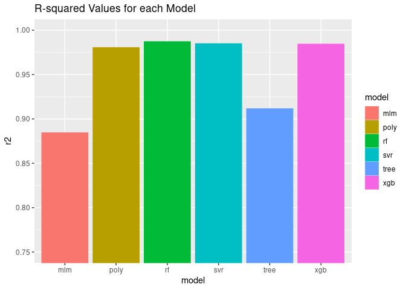
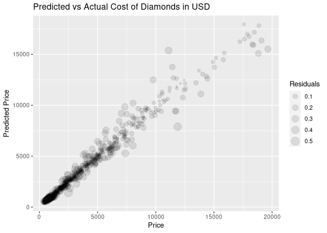

Best Day of My Life
================
Heather Zurel
2022-09-08

The best day of my life was when my partner asked me to marry him. He
was curious whether he overpaid for the diamond he bought me (he thinks
he got a great deal!) - so let’s see.

I’m going to use the diamonds data set to train a regression model to
predict the price of diamonds based on their physical properties,
including size/carat, clarity, colour, etc.

The first step is some **exploratory data analysis** to see if we need
to do anything to clean the data before training the model.

P.S. There are some additional analyses, plots, etc. that are included
in the `diamonds.r` file in github, which have not made it to this
document.

# Preparation and Exploratory Data Analysis

``` r
# Setup
library('tidyverse')
library('GGally')

# Import
data(diamonds)

# Exploratory 
summary(diamonds)
```

    ##      carat               cut        color        clarity          depth      
    ##  Min.   :0.2000   Fair     : 1610   D: 6775   SI1    :13065   Min.   :43.00  
    ##  1st Qu.:0.4000   Good     : 4906   E: 9797   VS2    :12258   1st Qu.:61.00  
    ##  Median :0.7000   Very Good:12082   F: 9542   SI2    : 9194   Median :61.80  
    ##  Mean   :0.7979   Premium  :13791   G:11292   VS1    : 8171   Mean   :61.75  
    ##  3rd Qu.:1.0400   Ideal    :21551   H: 8304   VVS2   : 5066   3rd Qu.:62.50  
    ##  Max.   :5.0100                     I: 5422   VVS1   : 3655   Max.   :79.00  
    ##                                     J: 2808   (Other): 2531                  
    ##      table           price             x                y         
    ##  Min.   :43.00   Min.   :  326   Min.   : 0.000   Min.   : 0.000  
    ##  1st Qu.:56.00   1st Qu.:  950   1st Qu.: 4.710   1st Qu.: 4.720  
    ##  Median :57.00   Median : 2401   Median : 5.700   Median : 5.710  
    ##  Mean   :57.46   Mean   : 3933   Mean   : 5.731   Mean   : 5.735  
    ##  3rd Qu.:59.00   3rd Qu.: 5324   3rd Qu.: 6.540   3rd Qu.: 6.540  
    ##  Max.   :95.00   Max.   :18823   Max.   :10.740   Max.   :58.900  
    ##                                                                   
    ##        z         
    ##  Min.   : 0.000  
    ##  1st Qu.: 2.910  
    ##  Median : 3.530  
    ##  Mean   : 3.539  
    ##  3rd Qu.: 4.040  
    ##  Max.   :31.800  
    ## 

``` r
ggpairs(diamonds)
```

<!-- -->

So the x, y, and z values correspond to the physical dimensions of the
diamonds in millimeters - these correlate strongly with the carat value,
which is a measure of the weight of the diamonds - this makes sense & we
really don’t need to include all of them. Some ML models are sensitive
to including multiple features which are strongly correlated with each
other - this can lead to overfitting - so we will remove the x, y, and z
variables before we train the model.

### Distribution of the Target Variable (Price in USD)

Q-Q plots (or quantile-quantile plots) are used to quickly, visually
identify the distribution of a single variable.

``` r
qq_diamonds <- qqnorm((diamonds$price),main="Normal Q-Q Plot of Price");qqline((diamonds$price))
```

<!-- -->

``` r
# Meh

qq_log_diamonds <- qqnorm(log(diamonds$price),main="Normal Q-Q Plot of log Price");qqline(log(diamonds$price))
```

<!-- -->

``` r
# Ooh this is a much better fit
```

``` r
hist_norm <- ggplot(diamonds, aes(log(price)))  + 
  geom_histogram(aes(y = ..density..), colour = "black", fill = 'lightblue', bins = 50) + 
  stat_function(fun = dnorm, args = list(mean = mean(log(diamonds$price)), sd = sd(log(diamonds$price))))
hist_norm
```

<!-- -->

Based on the Q-Q plots and the histogram, it appears that the log of the
price follows a bimodal or multimodal distribution. Let try another
couple plots to see.

``` r
violin <- ggplot(diamonds, aes(x = color, y = log(price), fill = color))
violin + geom_violin() + scale_y_log10() + facet_grid(clarity ~ cut)
```

<!-- -->

``` r
carat <- ggplot(data = diamonds, aes(x = carat, y = log(price), colour = color)) 
carat + stat_ecdf() + facet_grid(clarity ~ cut)
```

<!-- -->

Yep, this definitely looks like a multimodal distribution with multiple
peaks in the distribution corresponding to increasing the carat of the
diamond from 0.99 to 1 carat, 1.99 to 2 carats, etc. And smaller jumps
around 1/2 carats.

### Variance of Numeric Variables

One more thing I’m going to check is the variance of the numeric
variables. If the variance of any variable is \>= 1 order of magnitude
different from the others, we will standardize these values. If the
variance of one variable is much larger than others, it can
over-emphasize the importance of these variables in training models.

``` r
diamonds %>% summarise_if(is.numeric, list(mean = mean, var = var)) %>% t()
```

    ##                    [,1]
    ## carat_mean 7.979397e-01
    ## depth_mean 6.174940e+01
    ## table_mean 5.745718e+01
    ## price_mean 3.932800e+03
    ## x_mean     5.731157e+00
    ## y_mean     5.734526e+00
    ## z_mean     3.538734e+00
    ## carat_var  2.246867e-01
    ## depth_var  2.052404e+00
    ## table_var  4.992948e+00
    ## price_var  1.591563e+07
    ## x_var      1.258347e+00
    ## y_var      1.304472e+00
    ## z_var      4.980109e-01

The `carat` variable is \> 1 order of magnitude less than that of the
`table` variable (and so close to 1 OOM smaller than `depth`), so we
will go ahead and standardize table and depth. However this should occur
after the data set has been split into the training and testing data
sets.

I think I have enough info for the next step…

# Data Cleaning

We are going to remove some variables that are strongly correlated with
each other, leaving a single variable which captures that data contained
in the other 3 variables.

We are going to convert the price to the log of the price. Since this
data set is from 2017 and I am trying to predict the value of a diamond
bought in 2021, we will also adjust for inflation (approx 10.55%).

Another important consideration before training the models is to deal
with the categorical data. Often, these will be converted to “dummy
variables” or one-hot-encoded. This works when there is no natural
ranking or order of the categories. Here, the cut, clarity, and color
all have a natural order. For example, a diamond with a “good” cut is
better than a diamond with a “fair” cut. If you imported this data from
r (`data(diamonds)`) then these variables will already be factors with
the correct order. However, if you downloaded a csv of this data set,
these will need to be converted from strings to ordered factors, so I
will include the transformation step here (even though it shouldn’t
change anything in my data set - though it appears that the ‘color’
variable is in the reverse order so I’ll fix that too). Note: the levels
in this function are assigned from worst to best.

After investigating the table and depth fields some more, these values
are the ratio to the average diameter of the diamond. The table %
influences the light performance of the diamond (i.e. how sparkly it
looks). The depth % affect the diamond’s brilliance and fire (I’m not
100% sure what this means, but we’ll see if it affects price).

``` r
diamonds <- diamonds %>%
  mutate(price = price * 1.1055) %>%
  mutate(log_price = log(price)) %>%
  select(-price, -x, -y, -z) %>%
  mutate(cut = factor(cut, levels = c('Fair', 'Good', 'Very Good', 'Premium', 'Ideal'), ordered = TRUE),
         color = factor(color, levels = c('J', 'I', 'H', 'G', 'F', 'E', 'D'), ordered = TRUE),
         clarity = factor(clarity, levels = c('I1', 'SI2', 'SI1', 'VS2', 'VS1', 'VVS2', 'VVS1', 'IF'), ordered = TRUE))

# This should show that these three variables are now ordered factors.
str(diamonds)
```

    ## tibble [53,940 × 7] (S3: tbl_df/tbl/data.frame)
    ##  $ carat    : num [1:53940] 0.23 0.21 0.23 0.29 0.31 0.24 0.24 0.26 0.22 0.23 ...
    ##  $ cut      : Ord.factor w/ 5 levels "Fair"<"Good"<..: 5 4 2 4 2 3 3 3 1 3 ...
    ##  $ color    : Ord.factor w/ 7 levels "J"<"I"<"H"<"G"<..: 6 6 6 2 1 1 2 3 6 3 ...
    ##  $ clarity  : Ord.factor w/ 8 levels "I1"<"SI2"<"SI1"<..: 2 3 5 4 2 6 7 3 4 5 ...
    ##  $ depth    : num [1:53940] 61.5 59.8 56.9 62.4 63.3 62.8 62.3 61.9 65.1 59.4 ...
    ##  $ table    : num [1:53940] 55 61 65 58 58 57 57 55 61 61 ...
    ##  $ log_price: num [1:53940] 5.89 5.89 5.89 5.91 5.91 ...

``` r
# Here's a little trick to get R to output the order all possible factor levels, instead of just the first few:
min(diamonds$cut)
```

    ## [1] Fair
    ## Levels: Fair < Good < Very Good < Premium < Ideal

``` r
min(diamonds$color)
```

    ## [1] J
    ## Levels: J < I < H < G < F < E < D

``` r
min(diamonds$clarity)
```

    ## [1] I1
    ## Levels: I1 < SI2 < SI1 < VS2 < VS1 < VVS2 < VVS1 < IF

#### Looks good!

# Model Prep & Training

Time to prepare the model for training. We will split the data into the
training and testing data sets.

Note: we also standardize (scale) the data after splitting the data set
to avoid **data leakage**. This means that the values of the training
data set are affecting the values of the testing data set because their
values are used in the standardization step. This can affect the
performance of the model when running the model on new data.

``` r
# Prep
library(caTools)
library(tictoc)

set.seed(42)

tic.clearlog()

split <- sample.split(diamonds$log_price, SplitRatio = 0.8)
diamonds_train <- subset(diamonds, split == TRUE)
diamonds_test <- subset(diamonds, split == FALSE)

diamonds_train <- diamonds_train %>% 
  mutate_at(c('table', 'depth'), ~(scale(.) %>% as.vector))
diamonds_test <- diamonds_test %>% 
  mutate_at(c('table', 'depth'), ~(scale(.) %>% as.vector))  

glimpse(diamonds_test)
```

    ## Rows: 9,706
    ## Columns: 7
    ## $ carat     <dbl> 0.30, 0.23, 0.30, 0.23, 0.23, 0.32, 0.32, 0.24, 0.30, 0.24, …
    ## $ cut       <ord> Good, Very Good, Very Good, Very Good, Very Good, Good, Good…
    ## $ color     <ord> I, H, J, F, E, H, H, F, I, E, H, F, E, H, G, G, H, G, F, G, …
    ## $ clarity   <ord> SI2, VS1, VS2, VS1, VS1, SI2, SI2, SI1, SI1, VVS1, SI1, VVS2…
    ## $ depth     <dbl> 1.0417048, -0.5231586, 0.2932918, -0.5911962, -1.5437217, 0.…
    ## $ table     <dbl> -0.6422915, -0.1949679, -0.1949679, -0.1949679, 0.2523558, -…
    ## $ log_price <dbl> 5.961084, 5.966766, 5.978034, 5.978034, 6.096750, 6.099234, …

``` r
# And let's check out the standardized variables:
mean(diamonds_test$table)
```

    ## [1] 8.708704e-16

``` r
sd(diamonds_test$table)
```

    ## [1] 1

``` r
# The other one (depth) look similar too, you can use the code in diamonds.r to check for yourself. 
```

Now that the data set is split into the testing and training data sets,
we will train a few different models, test their performance, and use
the best one to make our prediction.

### Multiple Linear Regression

``` r
tic('mlm')
mlm <- lm(log_price ~ ., diamonds_train)
toc(log = TRUE, quiet = TRUE)
summary(mlm)
```

    ## 
    ## Call:
    ## lm(formula = log_price ~ ., data = diamonds_train)
    ## 
    ## Residuals:
    ##     Min      1Q  Median      3Q     Max 
    ## -5.8529 -0.2258  0.0605  0.2531  1.5885 
    ## 
    ## Coefficients:
    ##              Estimate Std. Error  t value Pr(>|t|)    
    ## (Intercept)  6.042146   0.004654 1298.384  < 2e-16 ***
    ## carat        2.167970   0.003860  561.587  < 2e-16 ***
    ## cut.L        0.065157   0.007584    8.592  < 2e-16 ***
    ## cut.Q       -0.009315   0.006074   -1.534   0.1251    
    ## cut.C        0.030696   0.005215    5.886 3.98e-09 ***
    ## cut^4        0.006782   0.004174    1.625   0.1042    
    ## color.L      0.510645   0.005811   87.878  < 2e-16 ***
    ## color.Q     -0.159645   0.005279  -30.240  < 2e-16 ***
    ## color.C      0.004640   0.004939    0.940   0.3475    
    ## color^4      0.039363   0.004538    8.674  < 2e-16 ***
    ## color^5      0.022161   0.004290    5.165 2.41e-07 ***
    ## color^6      0.004631   0.003903    1.187   0.2354    
    ## clarity.L    0.768912   0.010191   75.449  < 2e-16 ***
    ## clarity.Q   -0.366598   0.009537  -38.441  < 2e-16 ***
    ## clarity.C    0.216408   0.008156   26.534  < 2e-16 ***
    ## clarity^4   -0.063964   0.006507   -9.830  < 2e-16 ***
    ## clarity^5    0.052507   0.005299    9.910  < 2e-16 ***
    ## clarity^6    0.006066   0.004606    1.317   0.1879    
    ## clarity^7    0.007096   0.004069    1.744   0.0812 .  
    ## depth       -0.001029   0.001921   -0.535   0.5923    
    ## table        0.014223   0.002188    6.500 8.14e-11 ***
    ## ---
    ## Signif. codes:  0 '***' 0.001 '**' 0.01 '*' 0.05 '.' 0.1 ' ' 1
    ## 
    ## Residual standard error: 0.3442 on 44213 degrees of freedom
    ## Multiple R-squared:  0.8884, Adjusted R-squared:  0.8884 
    ## F-statistic: 1.76e+04 on 20 and 44213 DF,  p-value: < 2.2e-16

## Polynomial Regression

``` r
tic('poly')
poly <- lm(log_price ~ poly(carat,3) + color + cut + clarity + poly(table,3) + poly(depth,3), diamonds_train)
toc(log = TRUE, quiet = TRUE)
summary(poly)
```

    ## 
    ## Call:
    ## lm(formula = log_price ~ poly(carat, 3) + color + cut + clarity + 
    ##     poly(table, 3) + poly(depth, 3), data = diamonds_train)
    ## 
    ## Residuals:
    ##     Min      1Q  Median      3Q     Max 
    ## -3.2508 -0.0859 -0.0011  0.0872  1.9011 
    ## 
    ## Coefficients:
    ##                   Estimate Std. Error  t value Pr(>|t|)    
    ## (Intercept)       7.855146   0.001432 5486.562  < 2e-16 ***
    ## poly(carat, 3)1 224.223650   0.153651 1459.304  < 2e-16 ***
    ## poly(carat, 3)2 -65.007798   0.136049 -477.825  < 2e-16 ***
    ## poly(carat, 3)3  20.466149   0.135187  151.391  < 2e-16 ***
    ## color.L           0.441946   0.002259  195.623  < 2e-16 ***
    ## color.Q          -0.086252   0.002053  -42.007  < 2e-16 ***
    ## color.C           0.009905   0.001916    5.169 2.36e-07 ***
    ## color^4           0.011069   0.001761    6.284 3.32e-10 ***
    ## color^5           0.008375   0.001664    5.033 4.86e-07 ***
    ## color^6          -0.001586   0.001514   -1.047 0.294889    
    ## cut.L             0.091883   0.003636   25.273  < 2e-16 ***
    ## cut.Q            -0.009912   0.002696   -3.676 0.000237 ***
    ## cut.C             0.012412   0.002088    5.944 2.80e-09 ***
    ## cut^4            -0.002513   0.001625   -1.546 0.122172    
    ## clarity.L         0.887564   0.003990  222.462  < 2e-16 ***
    ## clarity.Q        -0.244990   0.003728  -65.708  < 2e-16 ***
    ## clarity.C         0.141636   0.003181   44.523  < 2e-16 ***
    ## clarity^4        -0.062813   0.002532  -24.807  < 2e-16 ***
    ## clarity^5         0.029161   0.002058   14.167  < 2e-16 ***
    ## clarity^6        -0.003592   0.001787   -2.010 0.044466 *  
    ## clarity^7         0.029769   0.001579   18.854  < 2e-16 ***
    ## poly(table, 3)1  -0.691116   0.179675   -3.846 0.000120 ***
    ## poly(table, 3)2  -0.603061   0.140336   -4.297 1.73e-05 ***
    ## poly(table, 3)3   0.591239   0.136248    4.339 1.43e-05 ***
    ## poly(depth, 3)1  -1.288272   0.162940   -7.906 2.71e-15 ***
    ## poly(depth, 3)2  -1.105807   0.168139   -6.577 4.86e-11 ***
    ## poly(depth, 3)3  -0.057543   0.134870   -0.427 0.669631    
    ## ---
    ## Signif. codes:  0 '***' 0.001 '**' 0.01 '*' 0.05 '.' 0.1 ' ' 1
    ## 
    ## Residual standard error: 0.1335 on 44207 degrees of freedom
    ## Multiple R-squared:  0.9832, Adjusted R-squared:  0.9832 
    ## F-statistic: 9.96e+04 on 26 and 44207 DF,  p-value: < 2.2e-16

Wow! The polynomial regression appears to fit a lot better!

## Support Vector Regression (SVR)

SVR does not depend on distributions of the underlying dependent and
independent variables. It can also be used to construct a non-linear
model with the `kernel = 'radial'` option. I think this is the case
because the linear model is performing the worst so far.

``` r
tic('svr')
library(e1071)
svr <- svm(formula = log_price ~ .,
                data = diamonds_train,
                type = 'eps-regression',
                kernel = 'radial')
toc(log = TRUE, quiet = TRUE)
```

## Decision Tree Regerssion

Decision Trees use a set of if-then-else decision rules. The deeper the
tree, the more complex the decision rules and the fitter the model.
Training DT models can sometimes lead to over-complex trees that do not
generalize the data well. This is called overfitting.

``` r
tic('tree')
library(rpart)
tree <- rpart(formula = log_price ~ .,
                  data = diamonds_train,
                  method = 'anova',
                  model = TRUE)
toc(log = TRUE, quiet = TRUE)
tree
```

    ## n= 44234 
    ## 
    ## node), split, n, deviance, yval
    ##       * denotes terminal node
    ## 
    ##  1) root 44234 46934.3000 7.922656  
    ##    2) carat< 0.695 20143  4323.3280 6.963920  
    ##      4) carat< 0.455 13848  1212.0970 6.718800 *
    ##      5) carat>=0.455 6295   448.8476 7.503143 *
    ##    3) carat>=0.695 24091  8615.3050 8.724275  
    ##      6) carat< 0.995 7837   612.7115 8.100690 *
    ##      7) carat>=0.995 16254  3485.7290 9.024943  
    ##       14) carat< 1.385 10379  1099.8590 8.772585  
    ##         28) clarity=I1,SI2,SI1 5582   243.9614 8.574533 *
    ##         29) clarity=VS2,VS1,VVS2,VVS1,IF 4797   382.1680 9.003046 *
    ##       15) carat>=1.385 5875   557.1727 9.470768 *

## Random Forest Regression

This takes the decision tree model a step further and uses many decision
trees to make better predictions than if you were using any of the
single decision trees in this model.

``` r
tic('rf')
library(randomForest)
rf <- randomForest(log_price ~ .,
                   data = diamonds_train,
                   ntree = 500,
                   importance = TRUE)
toc(log = TRUE, quiet = TRUE)
rf
```

    ## 
    ## Call:
    ##  randomForest(formula = log_price ~ ., data = diamonds_train,      ntree = 500, importance = TRUE) 
    ##                Type of random forest: regression
    ##                      Number of trees: 500
    ## No. of variables tried at each split: 2
    ## 
    ##           Mean of squared residuals: 0.01159442
    ##                     % Var explained: 98.91

## XGBoost Regression

XGBoost uses gradient boosted decision trees and is a really robust
model which performs very well on a broad variety of applications. It is
also not as sensitive to issues that affect the performance of some
other models such as multicolinearity, or data
normalization/standardization.

``` r
tic('xgb')
library(xgboost)
diamonds_train_xgb <- diamonds_train %>%
  mutate_if(is.factor, as.numeric)
diamonds_test_xgb <- diamonds_test %>%
  mutate_if(is.factor, as.numeric)

xgb <- xgboost(data = as.matrix(diamonds_train_xgb[-7]), label = diamonds_train_xgb$log_price, nrounds = 6166, verbose = 0)
# the rmse stopped decreasing after 6166 rounds 
toc(log = TRUE, quiet = TRUE)
```

# Model Performance

Now we will predict the log of the price of diamonds in the test data
set using each model we trained to determine which model performs best
on data it has not seen.

``` r
# Make predictions and compare model performance
tic('predict_all')
mlm_pred <- predict(mlm, diamonds_test)
poly_pred <- predict(poly, diamonds_test)
svr_pred <- predict(svr, diamonds_test)
tree_pred <- predict(tree, diamonds_test)
rf_pred <- predict(rf, diamonds_test)
xgb_pred <- predict(xgb, as.matrix(diamonds_test_xgb[-7]))
toc(log = TRUE, quiet = TRUE)

# Calculate residuals (i.e. how different the predictions are from the log_price of the test data set)
xgb_resid <- diamonds_test_xgb$log_price - xgb_pred
library(modelr)
resid <- diamonds_test %>%  
  spread_residuals(mlm, poly, svr, tree, rf) %>%
  select(mlm, poly, svr, tree, rf) %>%
  rename_with( ~ paste0(.x, '_resid')) %>%
  cbind(xgb_resid)

predictions <- diamonds_test %>%
  select(log_price) %>%
  cbind(mlm_pred) %>%
  cbind(poly_pred) %>%
  cbind(svr_pred) %>%
  cbind(tree_pred) %>%
  cbind(rf_pred) %>%
  cbind(xgb_pred) %>%
  cbind(resid)           # This will be useful for plotting later

# Calculate R-squared - this describes how much of the variability is explained by the model - the closer to 1, the better

mean_log_price <- mean(diamonds_test$log_price)
tss =  sum((diamonds_test_xgb$log_price - mean_log_price)^2 )

square <- function(x) {x**2}
r2 <- function(x) {1 - x/tss}

r2_df <- resid %>%
  mutate_all(square) %>%
  summarize_all(sum) %>%
  mutate_all(r2) %>%
  gather(key = 'model', value = 'r2') %>%
  mutate(model = str_replace(model, '_resid', ''))
r2_df
```

    ##   model        r2
    ## 1   mlm 0.8842696
    ## 2  poly 0.9803430
    ## 3   svr 0.9847216
    ## 4  tree 0.9114766
    ## 5    rf 0.9870050
    ## 6   xgb 0.9842275

# Visualize Performance of the Model

The Random Forest model performed best according to the R^2 value - this
is a measure of how much of the variability in the data set is explained
by the model, so we will mostly focus on this one for visualizations. It
is equal to 1 - RMSE (root mean square error, which describe how
different all the predictions are from the true values in the `y_test`
data set).

``` r
library(ggplot2)
r2_plot <- ggplot(r2_df, aes(x = model, y = r2, colour = model, fill = model)) + geom_bar(stat = 'identity')
r2_plot + ggtitle('R-squared Values for each Model') + coord_cartesian(ylim = c(0.75, 1))
```

<!-- -->

``` r
sample <- predictions %>%
  slice_sample(n = 1000) 
ggplot(sample, aes(x = exp(log_price), y = exp(rf_pred), size = abs(rf_resid))) +
  geom_point(alpha = 0.1) + labs(title = 'Predicted vs Actual Cost of Diamonds in USD', x = 'Price', y = 'Predicted Price', size = 'Residuals')
```

<!-- -->

The **Random Forest** model is performing the best out of all the models
we tried. This isn’t surprising, as it is an **ensemble method** which
means it uses the concordance between multiple models to make better
predictions than any of the models could make on their own. XGBoost is
another example of an ensemble method, and also performed very well. In
the second plot, the size is proportionate to the absolute value of the
residuals, which means how different the prediction was from the real
value.

## Feature Importance

Which variable(s) were the most important for predicting the price of
the diamonds?

``` r
varImpPlot(rf)
```

<!-- -->

The values on the x axis indicate how much the prediction error would
increase if that variable were not included in the model. As expected,
the carat (or size) is the most important variable. Even though table
and depth are supposed to impact how sparkly the diamond appears, they
don’t actually have that big an effect on the price.

## How long did it take to train models and make predictions?

``` r
# Training & predicting times
time_log <- tic.log(format = TRUE)
time_log
```

    ## [[1]]
    ## [1] "mlm: 0.057 sec elapsed"
    ## 
    ## [[2]]
    ## [1] "poly: 0.154 sec elapsed"
    ## 
    ## [[3]]
    ## [1] "svr: 194.602 sec elapsed"
    ## 
    ## [[4]]
    ## [1] "tree: 0.248 sec elapsed"
    ## 
    ## [[5]]
    ## [1] "rf: 407.62 sec elapsed"
    ## 
    ## [[6]]
    ## [1] "xgb: 62.249 sec elapsed"
    ## 
    ## [[7]]
    ## [1] "predict_all: 8.219 sec elapsed"

So the best performing models are taking the longest to train. Not a
huge surprise since they actually include many models. Keep in mind that
this is not a large data set. Most models I have trained for work take
hours and hours (I mostly set them up to run overnight). This can be
sped up with a really powerful machine in AWS or even a cluster of
machines.
